# Illegal Logging Detector 

# Table of Contents: 
 
- [Illegal Logging Detector](#illegal-logging-detector)
- [Table of Contents:](#table-of-contents)
- [Introduction:](#introduction)
- [Solution:](#solution)
  - [Features:](#features)
- [Hardware, Software and Services:](#hardware-software-and-services)
  - [Hardware:](#hardware)
  - [Software:](#software)
  - [Services:](#services)
- [Connection Diagram:](#connection-diagram)
  - [Backend Diagram:](#backend-diagram)
  - [Hardware Diagram:](#hardware-diagram)
- [Capture Data:](#capture-data)
  - [Setup Quickfeather:](#setup-quickfeather)
  - [Capturing Data:](#capturing-data)
  - [Labeling Data:](#labeling-data)
- [SensiML:](#sensiml)
- [Testing Model:](#testing-model)
- [Serial Interface:](#serial-interface)
- [LoraWAN Module:](#lorawan-module)
  - [Hardware:](#hardware-1)
  - [Sofware:](#sofware)
    - [**Configure the credentials in the TTN creds.h file**](#configure-the-credentials-in-the-ttn-credsh-file)
    - [**Set the correct frequency of LoraWAN**](#set-the-correct-frequency-of-lorawan)
    - [**Serial to LoraWAN Processing**](#serial-to-lorawan-processing)
  - [TTN:](#ttn)
  - [TTN to AWS IoT:](#ttn-to-aws-iot)
    - [**TTN MQTT to AWS API Gateway**:](#ttn-mqtt-to-aws-api-gateway)
    - [**AWS API Gateway to AWSLambda**:](#aws-api-gateway-to-awslambda)
    - [**AWSLambda to AWS IoT**:](#awslambda-to-aws-iot)
    - [Backend DEMO:](#backend-demo)
- [Power Consumption:](#power-consumption)
- [WebPage Deploy:](#webpage-deploy)
  - [AWS Cognito:](#aws-cognito)
  - [AWS IoT WebSocket:](#aws-iot-websocket)
    - [**Decode IN Data**:](#decode-in-data)
- [Final Product:](#final-product)
- [EPIC DEMO:](#epic-demo)

# Introduction:

Avoid illegal logging in protected areas.

We can find that just in Mexico (my home country) [1] 70 percent of the wood consumed is of illegal origin according to a study carried out by one of the most prestigious universities UNAM (QS ranking # 100).

https://translate.google.com/translate?sl=es&tl=en&u=https://www.dgcs.unam.mx/boletin/bdboletin/2018_173.html

I’ll  create a system that is capable of recognizing, through Machine Learning the sounds generated by falling trees, chainsaws and human voices in protected areas, thus warning that illegal logging may be occurring.

Especialmente quiero un sistema que pueda ayudar a proteger los bosques y las especies que lo habitan.

Most solutions are based on raising awareness, but looking at more dedicated solutions wee can find:

TreeTAG is an emerging smartphone-based supply chain traceability system developed by Earth Observation Systems that tracks the location of logs transported from the forest to the mill.

Disadvantages: Very complex system that requires authorized personnel to be manipulated.

Stardust is a dust-like material that can be sprayed onto wood and detected only with a hand-held device. 

Disadvantages: You need to tag manually every tree which is labor intensive and expensive..

# Solution:

My system, it will be easily reproducible, energy efficient and powerful thanks to the ML algorithms that will be implemented combined with the cloud services that we will use for deployment.

With the Infineon IM69D130 PDM digital microphone included in the QuickFeather Development Kit i will obtain an audio signal which, through SensiML, we can pass through a neural network. That will tell us if the noise of a saw cutting the trees or human voice in the forest.

Desplegando la informacion de los eventos detectectados en una sencilla webapp, junto con un mapa el cual nos indicara la posicion del evento.

## Features:

* Low-power battery consumption (Quickfeather and LoraWAN).
* High accuracy (thanks to sensiml).
* Easy production at large scale, due to its simplicity.

# Hardware, Software and Services:

## Hardware:

* QuickFeather Development Kit. 1x.
  * https://www.quicklogic.com/products/eos-s3/quickfeather-development-kit/
* B-L072Z-LRWAN1. 1x.
  * https://www.st.com/en/evaluation-tools/b-l072z-lrwan1.html
* X-NUCLEO-IKS01A3. 1x.
  * https://www.st.com/en/ecosystems/x-nucleo-iks01a3.html
* AAA Batteries. 3x.

## Software:

* SensiML.
  * https://sensiml.com/
* Data capture lab.
  * https://sensiml.com/products/data-capture-lab/
* Python.
  * https://www.python.org/
* ReactJS.
  * https://reactjs.org/
* OpenLayers Maps.
  * https://openlayers.org/
* Qorc SDK.
  * https://github.com/QuickLogic-Corp/qorc-sdk/
* Zephyr RTOS.
  * https://www.zephyrproject.org/

## Services:

* Docker.
  * https://www.docker.com/
* AWS ECR.
  * https://aws.amazon.com/ecr/
* AWS ECS.
  * https://aws.amazon.com/ecs/
* AWS Lambda.
  * https://aws.amazon.com/lambda/
* AWS API Gateway.
  * https://aws.amazon.com/api-gateway/
* AWS IoT.
  * https://aws.amazon.com/iot/
* AWS Cognito.
  * https://aws.amazon.com/cognito/
* AWS S3.
  * https://aws.amazon.com/s3/

# Connection Diagram:

## Backend Diagram:

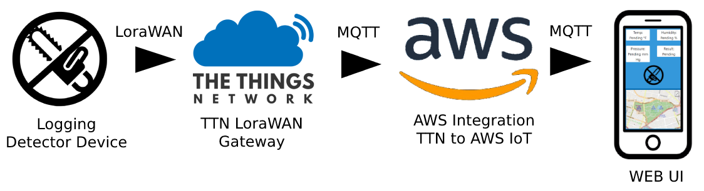

## Hardware Diagram:

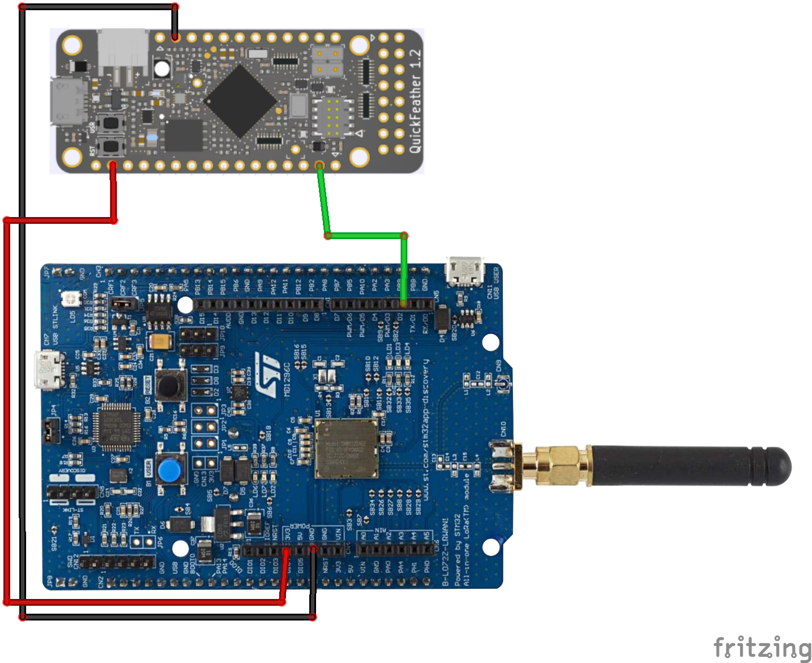

# Capture Data:

En esta seccion explicare como realice la medicion de los datos desde el QuickFeather hacia el Data capture lab.

## Setup Quickfeather:

Primero tenemos que configurar el QuickFeather en modo de captura de datos, en la capeta Capture Project les dejo el proyecto completo con todos lo cambios realizados para capturar datos. 

Desde la documentacion oficial puedes ver ver todos los pasos para setup el enviroment de desarrollo.
https://github.com/QuickLogic-Corp/qorc-sdk

En el caso de que solo requieras empezar a cpturar los datos, dejo el binario compilado para que puedas flash tu QuickFeather con el programa y poder capturar datos rapidamente.

Video: Click on the image
[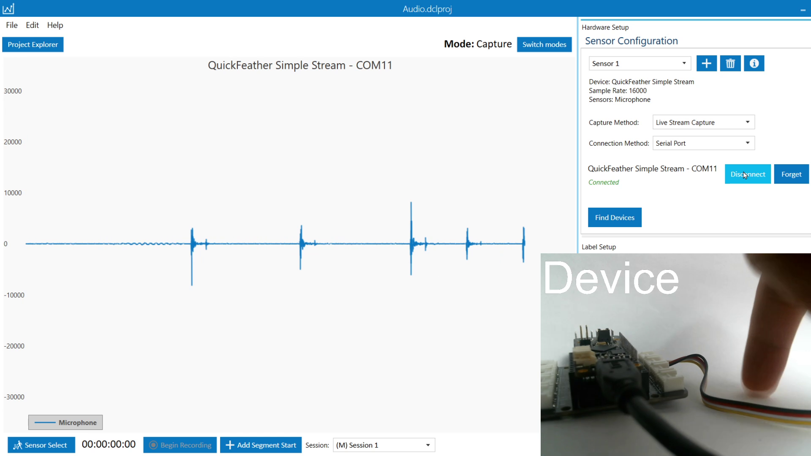](https://youtu.be/UMFaDWV3vuo)

## Capturing Data:

En el caso de mi proyecto, lo mas sencillo fue grabar el sonido de varias motosierra para poder entrenar correctamente el modelo.

NOTA: Los audios capturados estaran en la carpeta SensiML Project.

Video: Click on the image
[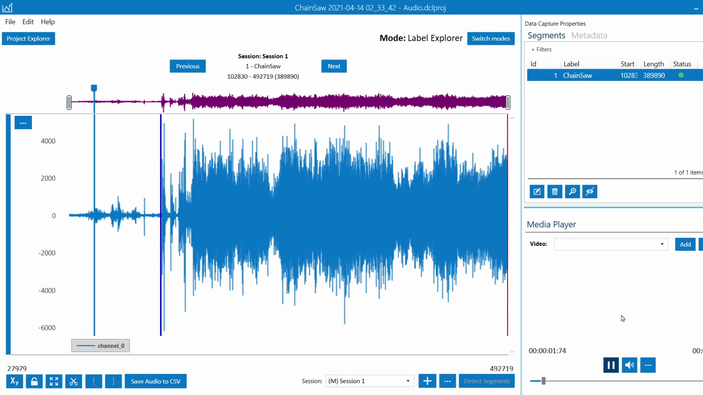](https://youtu.be/CJEcgRphHlY)

## Labeling Data:

En mi caso realice el labeling de las siguientes categorias para mi modelo.

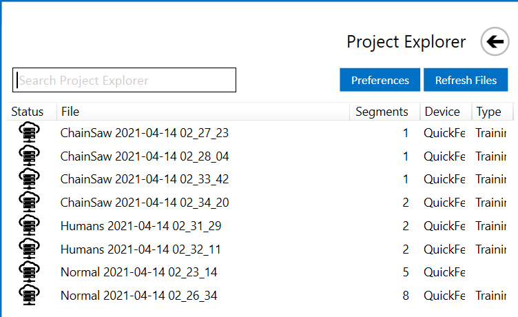

En este caso, el sistema es capaz de detectar el sonido de sierras mecanicas, humanos y silencio neutral, con el fin de evitar falsas alarmas del sistema.

# SensiML:

Estas fueron las espcificaciones de los datos en SensiML.

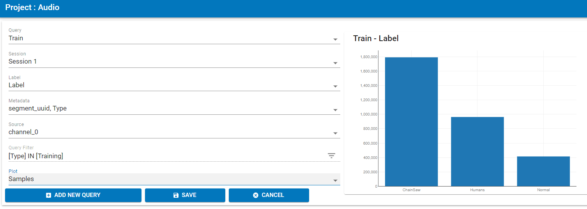

Estas fueron las especificaciones del entrenamiento del modelo.

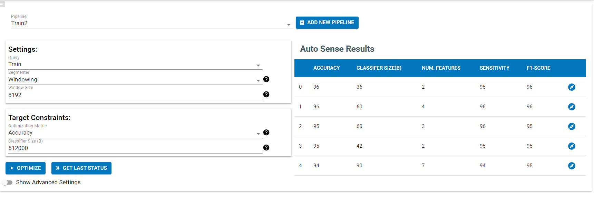

Aqui los resultados de la presicion del modelo contra los datos utilizados.

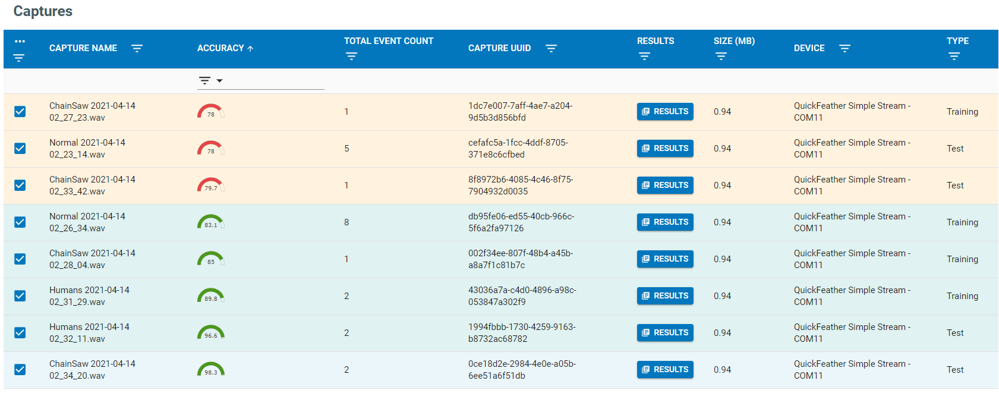 

Y por ultimo las especificaciones de el binario compilado que esta en el repositorio.

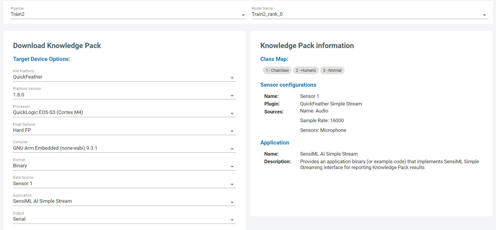

# Testing Model:

En este caso puen ver en el video como el modelo funciona correctamente para la deteccion de voz humana y deteccion de una Chainsaw. Esta prueba la estamos relizando al ver la salida del serial del QuickFeather.

NOTA: la salida serial esta a 460800 baudrate, la board B-L072Z-LRWAN1 alcanza perfectamente estas frecuencias de serial.

Video: Click on the image
[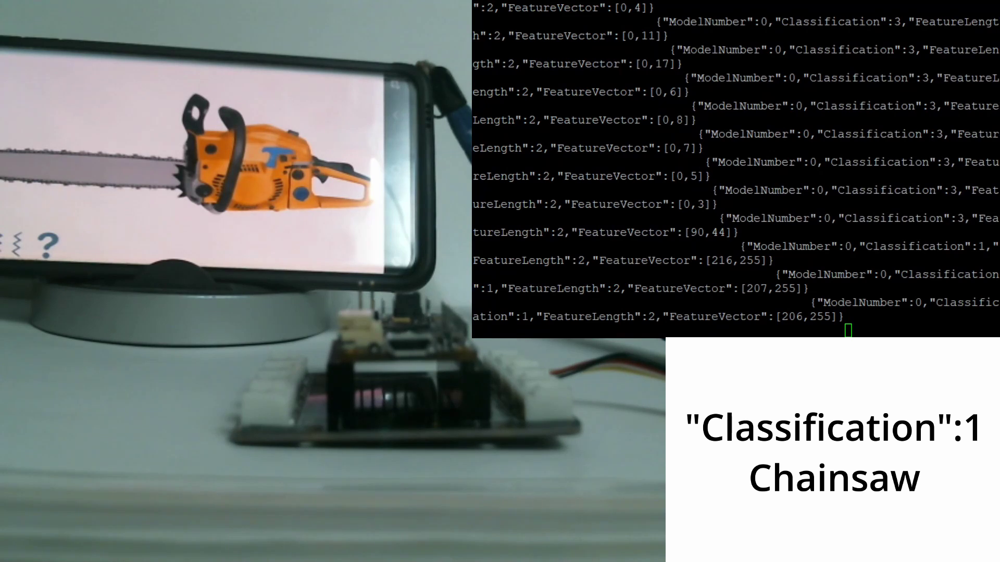](https://youtu.be/ydsBVdKkfGk)

# Serial Interface:

Para poder mandar los resultados del modelo a la B-L072Z-LRWAN1, conectamos el pin TX de la placa, el cual tiene una salida serial a 460800 baudrate a el pin D2 como se muestra en el esquema.

| QuickFeather PIN | B-L072Z-LRWAN1 PIN |
|------------------|--------------------|
| 3.3 V            | 3.3 V              |
| GND              | GND                |
| TX PIN           | D2                 |

Finalmente solde todo en una protoboard para evitar fallos al utilizar cables o jumpers.

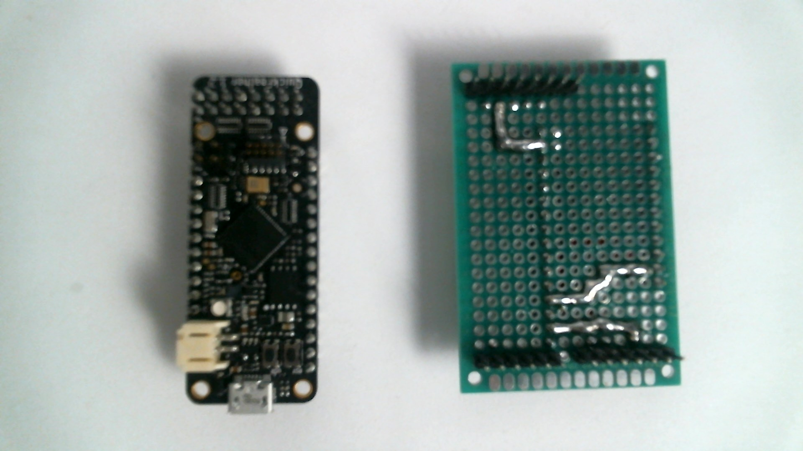
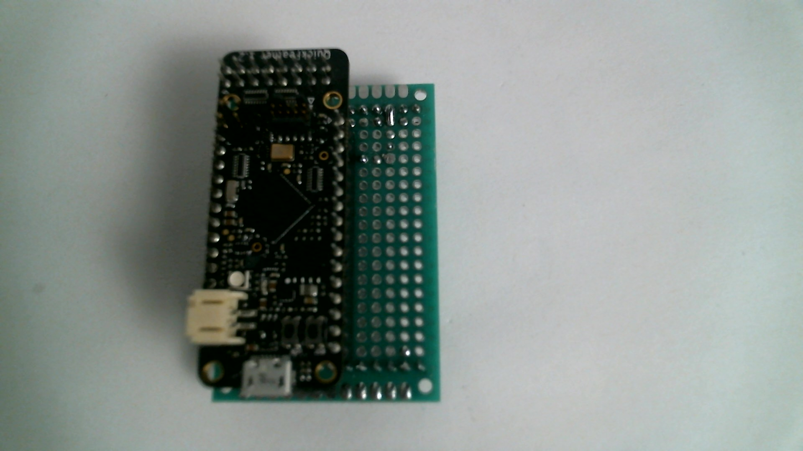
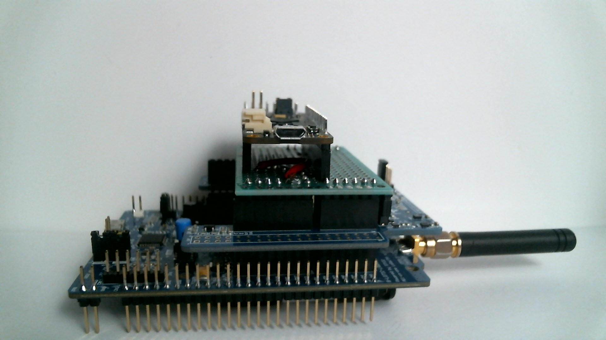

# LoraWAN Module:

En esta seccion explicaremos todos los detalles de la transmision de datos desde que mandamos los datos de la QuickFeather por serial a la B-L072Z-LRWAN1, hasta que llega a AWS IoT.

## Hardware:

El hardware itilizado para este modulo fue una B-L072Z-LRWAN1 y el combo se sensores X-NUCLEO-IKS01A3.

* B-L072Z-LRWAN1.
  * https://www.st.com/en/evaluation-tools/b-l072z-lrwan1.html
* X-NUCLEO-IKS01A3.
  * https://www.st.com/en/ecosystems/x-nucleo-iks01a3.html

## Sofware:

El software de la board estara en la carpeta Serial2Lora_STM32L0 donde estara el proyecto para Arduino IDE.

### **Configure the credentials in the TTN creds.h file**

(details of these credentials in the [TTN](#ttn) section).

    static const char *appEui  = "XXXXXXXXXXXXXXXX";
    static const char *appKey  = "XXXXXXXXXXXXXXXXXXXXXXXXXXXXXXXX";
    static const char *devEui  = "XXXXXXXXXXXXXXXX";

### **Set the correct frequency of LoraWAN**

US915 for Mexico.

    #define REGION_US915

### **Serial to LoraWAN Processing**

    if (Serial1.available()) {
      String temp = Serial1.readString(); // Reading Serial

      // Processing serial read to get classification only

      int checkpoint1 = temp.indexOf(":", 25);
      int checkpoint2 = temp.indexOf(",", 25);
      temp = temp.substring(checkpoint1 + 1, checkpoint2);

      // Append classification in lora message

      my_string = temp + "," + String(int(humidity)) + "," + String(int(temperature)) + "," + String(int(pressure));
      uint8_t payload[my_string.length() + 1];
      my_string.getBytes(payload, my_string.length() + 1);

      // Send to TTN 

      sendResult(payload, my_string.length() + 1);
      delay(1000);
    }

## TTN:

Para comunicar el device con TTN, necesitamos primero estar en el rango de los Gateways de TTN.

Revisar cobertura en: https://www.thethingsnetwork.org/map

Si estas en cobertura, primero tenemos que crear una aplicacion TTN como dice la documentacion oficial:

https://www.thethingsnetwork.org/docs/applications/add/

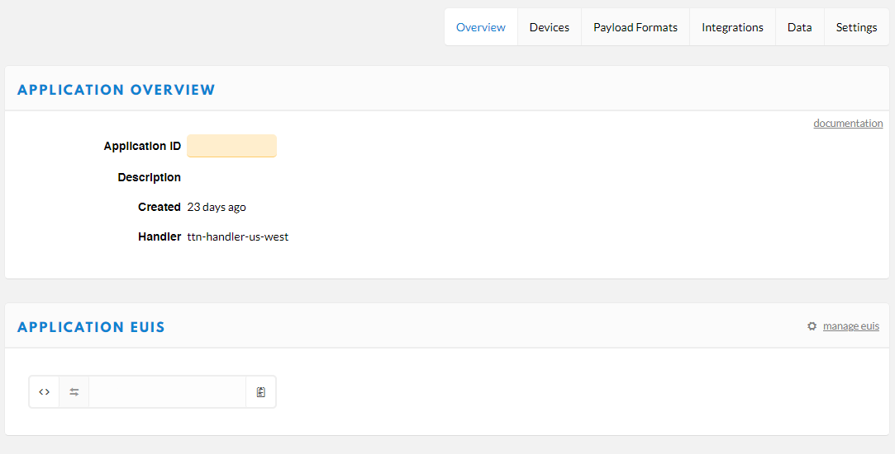

Ahora que tenemos nuestra app deberemos registrar nuestro device para obtener las credenciales. 

https://www.thethingsnetwork.org/docs/devices/registration/

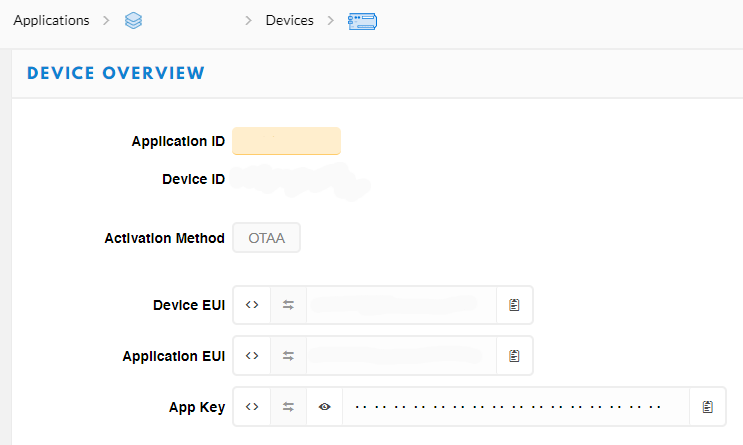

## TTN to AWS IoT:

Mi primer intento por comunicar TTN con AWSIoT fue a travez de la documentacion oficial de TTN. Sin embargo su integracion no esta actualizada al dia de hoy 04/05/2021.

https://www.thethingsnetwork.org/docs/applications/aws/

En este caso decidi realiza mi propia integracion a travez de los siguientes sevicios de AWS.

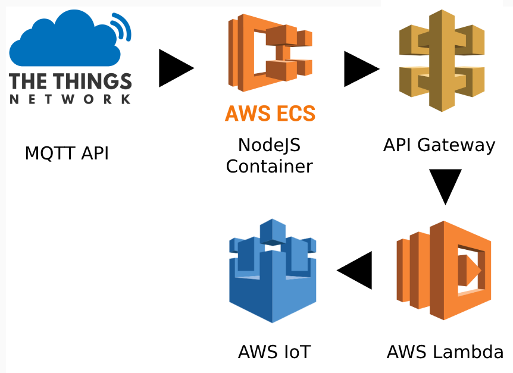

### **TTN MQTT to AWS API Gateway**:

Ya que busco que esta sea una integracion reproducible a cualquier sistema, decidi relizar una integracion basada en con contenedor de NodeJS, este contenedor esta en la carpeta AWS Integration\Container.

De forma sencilla el contenedor recibe todos los datos que recibe la app de ttn mediante la API de MQTT y todo lo manda a una API propia como request.

    client.on('message', function (topic, message) {
        console.log(message.toString())
        unirest('POST', data.myAPIurl)
            .headers({
                'Content-Type': 'application/json'
            })
            .send(message.toString())
            .end(function (res) {
                if (res.error) throw new Error(res.error);
                console.log(200);
            });
    })

Para desplegar este contenedor en AWS utilice el servicio ECR para subir el contenedor a AWS y ECS para desplegarlo. Sin embargo puedes deplegarlo en tu computadora mediante Docker sin ningun problema.

NOTA: El codigo estara completamente comentado de que esta haciendo.

### **AWS API Gateway to AWSLambda**:

Una vez que el mensaje llego a AWS API Gateway, tenemos que relizar alguna accion con el, para esto deplegamos un codigo de Lambda en la API para redireccionar el mensaje completo a AWS IoT.

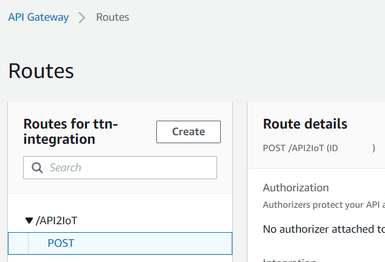

### **AWSLambda to AWS IoT**:

El programa que se ejecuta al llegar el mensaje desde el contenedor es el siguiente. Ademas el codigo esta en la carpeta AWS Integration\Lambda.

    import json
    import boto3

    client = boto3.client("iot-data")

    def lambda_handler(event, context):
        response = client.publish(
                topic="ttn/echo",
                qos=1,
                payload=json.dumps(event["body"]))
        return {
            'statusCode': 200,
            'body': json.dumps('TTN Correct!')
        }

Todos los mensajes que mandemos desde nuestro device, por TTN a AWSIoT llegaran al topic ttn/echo.

### Backend DEMO:

Aqui una demostracion de todo el backend funcionando al mismo tiempo.

Video: Click on the image
[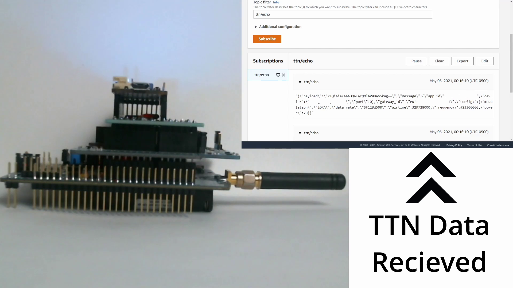](https://youtu.be/p_ZSyW9KK2k)

# Power Consumption:

Para el proyecto es de suma importancia ver el consumo energetico de nuestro dispositivo, asi que decidi con el Power Profiler Kit II de Nordic, hacer un analisis de los mAh que consume el dispositivo.

La inicializacion completa de todo el device es de aproximadamente 40 segundos con un consumo promedio de 45mA y picos de 132mA.

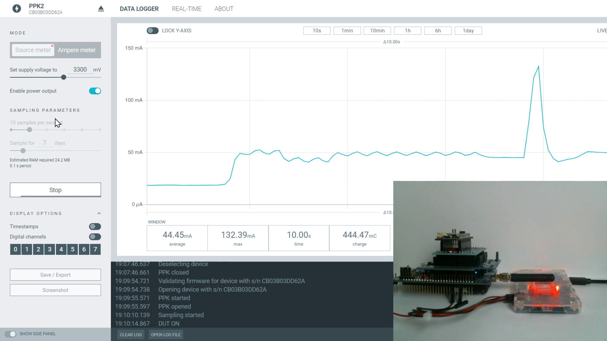

Sin embargo lo que nos interesa es el consumo de poder a largo plazo, entonces analizando el consumo despues de la inicializacion, encontramos una zona estable de 48.7 mAh.

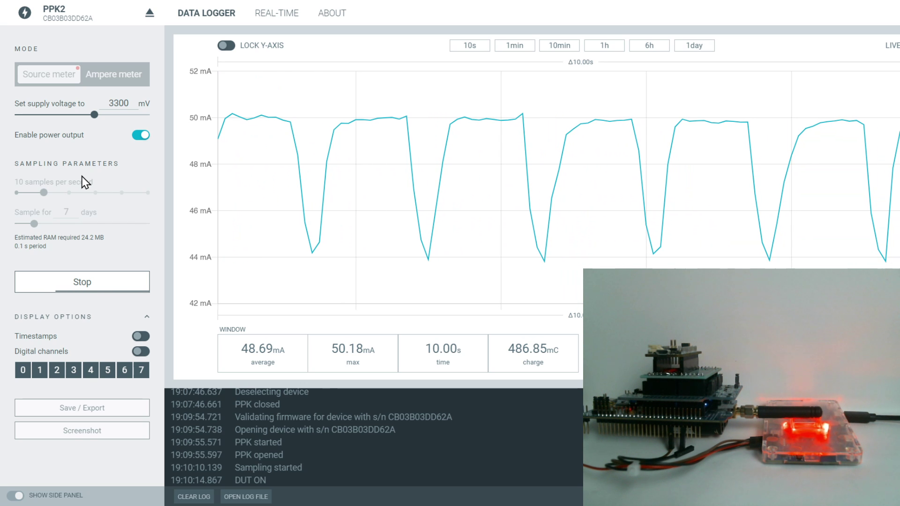

Asi que el modulo de LoraWAN unicamente agrega 10mAh al consumo del device.

Video: Click on the image
[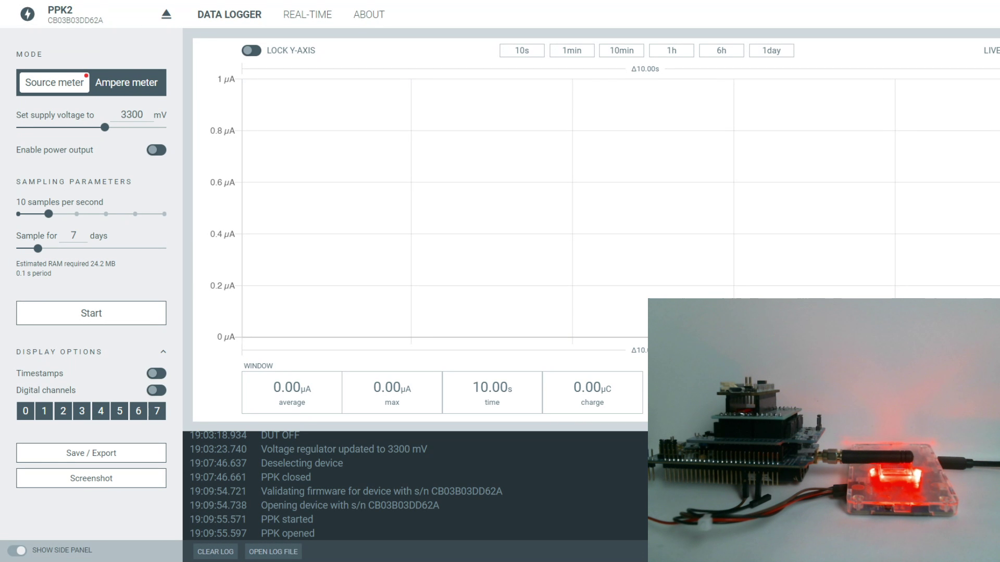](https://youtu.be/6QJh2mOm6js)

# WebPage Deploy:

El despliegue de la pagina web se realizo mediante ReactJS, OpenLayers (Maps) y AWS-SDK para javascript.

Desktop:

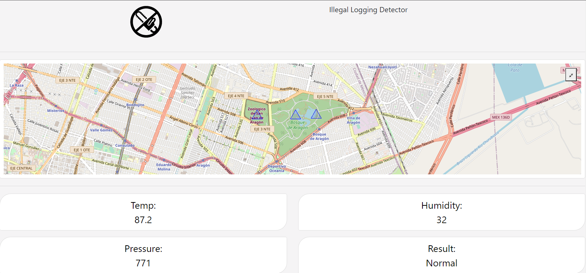

Mobile:

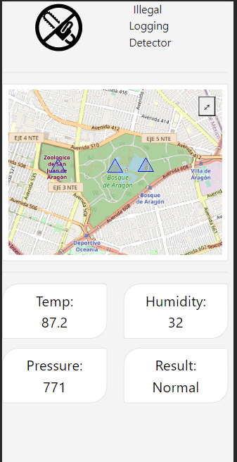

https://illegal-logging-detector.s3.amazonaws.com/index.html

## AWS Cognito:

Por seguridad, para utilizar y consumir de forma segura los servicios de AWS se implementaron credenciales de **identity pool** con el servicio Cognito.

Las claves de acceso para AWSIoT y Cognito deben de ser colocadas en el siguiente archivo.

Webapp/src/components/aws-configuration.js

    var awsConfiguration = {
      poolId: "us-east-1:XXXXXXXXXXXXXXX", // 'YourCognitoIdentityPoolId'
      host:"XXXXXXXXXXXXXX-ats.iot.us-east-1.amazonaws.com", // 'YourAwsIoTEndpoint', e.g. 'prefix.iot.us-east-1.amazonaws.com'
      region: "us-east-1" // 'YourAwsRegion', e.g. 'us-east-1'
    };
    module.exports = awsConfiguration;

## AWS IoT WebSocket:

La pagina web recibe los datos del sensor mediante AWSIoT como web socket, asi que es importante definir dentro de la pagina, cual es el topic que vamos a recibir, en este caso "ttn/echo" como pudimos ver en video de [Backend Video](#backend-demo).

En el siguiente archivo coloca el nombre del topic al cual estaras suscrito.

Webapp/src/App.js

    <IotReciever sub_topics={["ttn/echo"]} callback={this.callBackIoT} />

### **Decode IN Data**:

Debido a que los datos que recibimos de TTN estan con un encoding de base64, requerimos decodificarlo con el siguiente codigo en la webapp.

    let payload = atob(temp["payload_raw"]).replace(' ', '').split(",")

Esto realiza una conversion como la que vemos en la imagen.

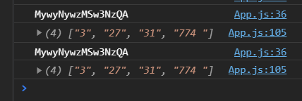

El arreglo se compone de 4 datos:

1. Resultado de la red neuronal.
2. Humedad Realtiva del ambiente.
3. Temperatura en grados centigrados (convertidos en farenheit en la pagina)
4. Presion atmosferica en mmHg.

# Final Product:

Case Open:

Case Close:

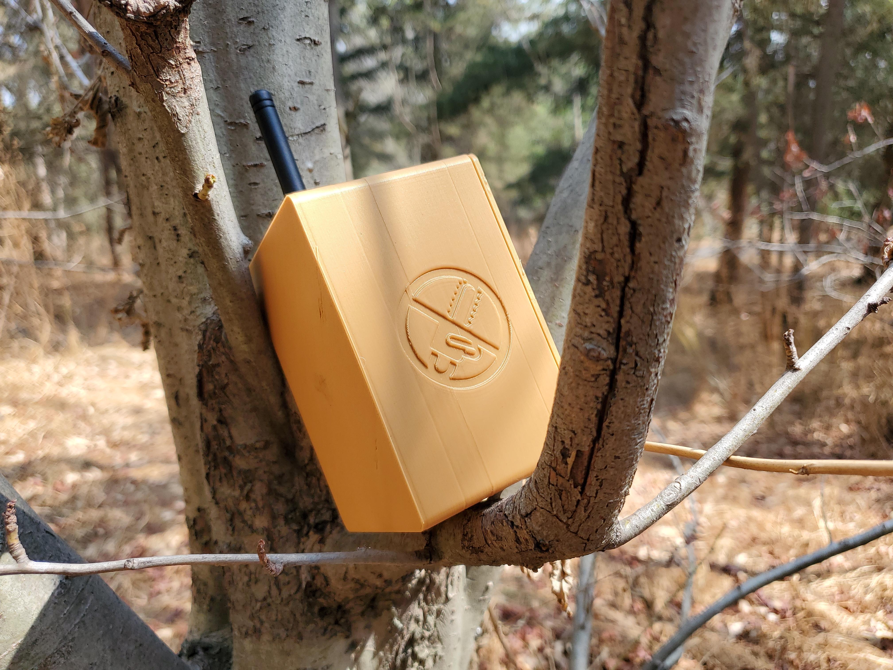

Platform UI:

https://illegal-logging-detector.s3.amazonaws.com/index.html

# EPIC DEMO:

Video: Click on the image

Sorry github does not allow embed videos.
